# VIS Projekt KAL0326 - Rezervace Klubů

# Artefakt 1

## Proč
- Zákazník potřebuje nový informační systém, protože dosavadní rezervace klubů probíhaly komplikovaně a neefektivně.

## Co
- Systém bude obsahovat databázi klubů, které s námi budou ochotni spolupracovat. Databáze bude spojena s webovou stránkou, na které si registrovaný uživatel bude moct vyhledat a vybrat klub podle zadaných kategorií. 
- Systém umožní uživateli rezervaci klubu na zadané datum a čas. 
- Dále bude mít každý uživatel k dispozici jeho historii rezervací a plateb. 

## Kdo
### Registrovaný uživatel 
- Osoba, která chce pronajmout klub a používat služby systému pro rezervaci klubu na určité datum a čas. 
### Neregistrovaný uživatel 
- Osoba, která si nebude moct pronajmout klub, ale bude se moct podívat na nabídku klubů. 
### Majitel klubu
- Bude spolupracovat s tímto systémem a bude zveřejňovat informace o klubu v databázi.  
- Bude také přijímat rezervace a platby od zákazníků. 
### Správce systému 
- Osoba nebo tým, který bude spravovat systém a databázi klubů. 
- Bude také řešit technické a provozní záležitosti, jako je zabezpečení systému a udržování dostupnosti pro uživatele.

## Kde
- Celý systém bude běžet na nově vytvořené webové stránce. 
- Webová stránka bude komunikovat s databází, která slouží jako centrální uložiště všech klubů a všech podrobností o nich.
- Dále bude webová stránka komunikovat s platební bránou, která bude umožňovat rychlou a bezpečnou online platbu rezervací. 

## Kdy
- Systém bude využíván při rezervaci klubů a správě uživatelských účtů.

## Jak
- Systém bude vyvíjen agilním způsobem (viz. obrázek níže).

# Artefakt 2

# Use Casy
## Obrázek

## Use Case 3
### Název: Vytvořit rezervaci
- Aktéři: Uživatel, Systém, Databáze
- Vstupní podmínky: Uživatel musí být registrovaný a přihlášený v systému a klub, který si vybral, musí existovat v databázi
- Spouštěč: Uživatel si chce rezervovat klub na dané datum a čas
- Úspěšný scénář:
  1. Uživatel se přihlásí do systému a chce podle zadaných podmínek vyhledat vhodný klub.
  2. Systém zpracuje požadavky uživatele a vrátí podle nich vyhovující kluby.
  3. Uživatel vybere ze seznamu klub
  4. Systém ověří dostupnost klubu na zvolené datum a čas a zobrazí uživateli rezervační formulář
  5. Uživatel vyplní rezervační formulář a bude chtít vytvořit rezervaci
  6. Systém zobrazí potvrzení rezervace a požádá uživatele o potvrzení.
  7. Uživatel potvrdí rezervaci.
  8. Systém odešle potvrzení rezervace uživateli a klubu.
  9. Systém vytvoří záznam o rezervaci v databázi a převede uživatele na platební bránu.
  10. Uživatel provede platbu.

### Aktivitní diagram pro Use Case 3

## Use Case 5 
### Název: Platba rezervace
- Aktéři: Uživatel, Systém, Platební brána
- Vstupní podmínky:
  1. Uživatel musí mít v systému vytvořenou rezervaci.
  2. Uživatel musí být přihlášený v systému.
  3. Platební brána musí být funkční a dostupná.
- Spouštěč: Uživatel si již vytvořil rezervaci klubu a chce provést platbu za tuto rezervaci
- Úspěšný scénář:
  1. Uživatel vybere rezervaci, kterou chce zaplatit.
  2. Systém uživateli zobrazí možnost pokračovat k platbě.
  3. Uživatel vybere preferovaný způsob platby.
  4. Systém přesměruje uživatele na platební bránu.
  5. Uživatel zadá potřebné platební údaje a potvrdí platbu.
  6. Platební brána ověří platbu.
  7. Systém obdrží informaci o úspěšné platbě.
  8. Systém vytvoří záznam o platbě v databázi.
  9. Systém pošle potvrzení o platbě uživateli a klubu.
  10. Rezervace je označena jako zaplacená a uživatel vidí stav v historii rezervací.

### Aktivitní diagram pro Use Case 5

## Use Case 1
### Název: Vyhledat kluby
- Aktéři: Uživatel, Systém, Databáze
- Vstupní podmínky: : Uživatel zadá všechny potřebné požadavky pro vyhledávání
- Spouštěč: Uživatel chce vyhledat vhodný klub
- Úspěšný scénář:
  1. Uživatel se přihlásí do systému.
  2. Uživatel přejde do sekce „Vyhledat kluby“.
  3. Systém zobrazí formulář pro zadání vyhledávacích kritérií (lokalita, kapacita, dostupnost).
  4. Uživatel zadá všechny požadované parametry a spustí vyhledávání kliknutím na tlačítko „Vyhledat“.
  5. Systém zpracuje zadané požadavky.
  6. Systém prohledá databázi klubů podle zadaných parametrů.
  7. Systém vrátí seznam klubů, které odpovídají uživatelovým kritériím.
  8. Uživatel si prohlédne zobrazené kluby a vybere vhodný klub pro další akce (např. rezervace).

### Aktivitní diagram pro Use Case 1

# Artefakt 3

# Konceptuální doménový model

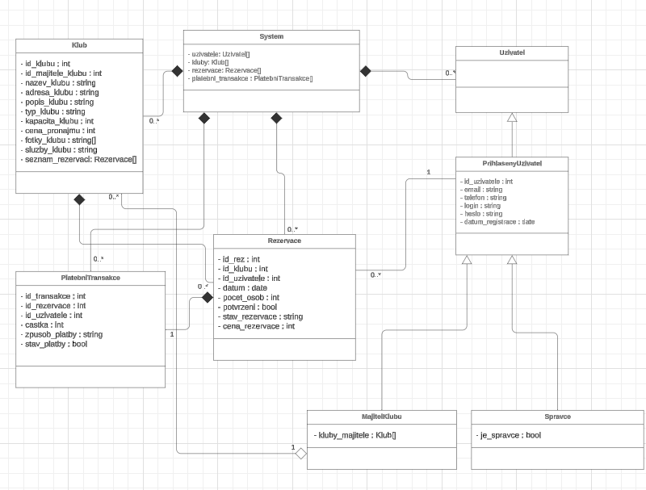

## Tabulka Klub
- Celkový odhad velikosti na záznam: ~1MB - 5.1MB.
- Odhad množství záznamů: 1 000 - 10 000 klubů.
- Celková velikost tabulky: ~1GB - 50GB

## Tabulka Uživatel
- Celkový odhad velikosti na záznam: ~250B.
- Odhad množství záznamů: 10 000 - 1 000 000 uživatelů.
- Celková velikost tabulky: ~2.5MB - 250MB.

## Tabulka Rezervace
- Celkový odhad velikosti na záznam: ~80B.
- Odhad množství záznamů: 100 000 - 10 000 000 rezervací.
- Celková velikost tabulky: ~8MB - 800MB.

## Tabulka Platební Transakce
- Celkový odhad velikosti na záznam: ~30B.
- Odhad množství záznamů: 50 000 - 5 000 000 transakcí.
- Celková velikost tabulky: ~1.5MB - 150MB.
  
## Odhad počtu uživatelů současně pracujících se systémem.
- Systém pro rezervace klubů má užší okruh uživatelů a není určen pro masivní provoz. Předpokládá se, že rezervační operace se dějí v konkrétních časech (např. večer a o víkendech).

### Průměrný provoz:
- Průměrný počet současně přihlášených uživatelů: ~20 až 50.
- To odpovídá běžné aktivitě během pracovního dne, kdy si uživatelé kontrolují rezervace nebo vytvářejí nové rezervace.
  
### Peak provoz (špička):
- Peak (špičkový provoz): ~200 až 500 uživatelů současně.
- Tento scénář by mohl nastat během večerů, víkendů nebo při mimořádných akcích (např. otevření rezervací na nové kluby, speciální akce či sezónní události).

## Typy interakcí uživatelů se systémem a jejich odhad náročnosti

## Vytvoření rezervace
- Popis: Uživatel si vybere klub, zadá počet osob a datum, systém vypočítá cenu a vytvoří rezervaci v databázi.
### Náročnost:
- Výpočetní náročnost: Nízká (vypočítání ceny na základě počtu osob a ceny za osobu).
- I/O náročnost: Střední (zápis nové rezervace do databáze).

## Vyhledávání klubů
- Popis: Uživatel zadá filtry (název, adresa, typ, kapacita, cena, datum) a systém vrátí seznam dostupných klubů.
### Náročnost:
- Výpočetní náročnost: Střední (filtrování dat na základě uživatelských kritérií).
- I/O náročnost: Vysoká (čtení velkého množství dat z databáze, aplikace filtrů).

## Platba rezervace
- Popis: Uživatel potvrdí rezervaci a vybere způsob platby (hotově/kartou). Systém aktualizuje stav rezervace.
### Náročnost:
- Výpočetní náročnost: Nízká (aktualizace stavu).
- I/O náročnost: Střední (zápis aktualizovaného stavu do databáze).

## Zrušení rezervace
- Popis: Uživatel může rezervaci zrušit, což systém označí aktualizací stavu rezervace.
### Náročnost:
- Výpočetní náročnost: Nízká.
- I/O náročnost: Střední (zápis změny stavu do databáze).

## Přihlášení/registrace uživatele
- Popis: Uživatel se přihlásí nebo zaregistruje. Při přihlášení systém ověřuje přihlašovací údaje.
### Náročnost:
- Výpočetní náročnost: Nízká (validace a hashování hesla).
- I/O náročnost: Střední (čtení/zápis uživatelských dat v databázi).

# Artefakt 4

# Wireframy

## Wireframe - Domovská stránka
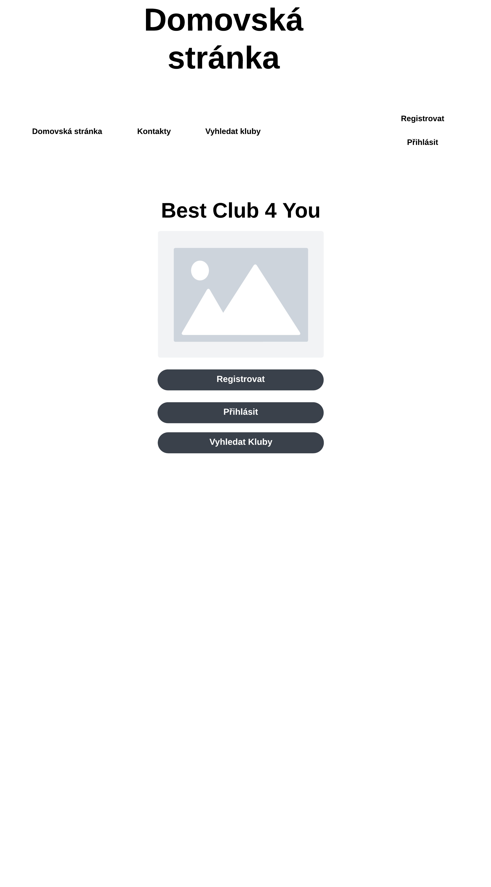

## Wireframe - Vyhledat kluby
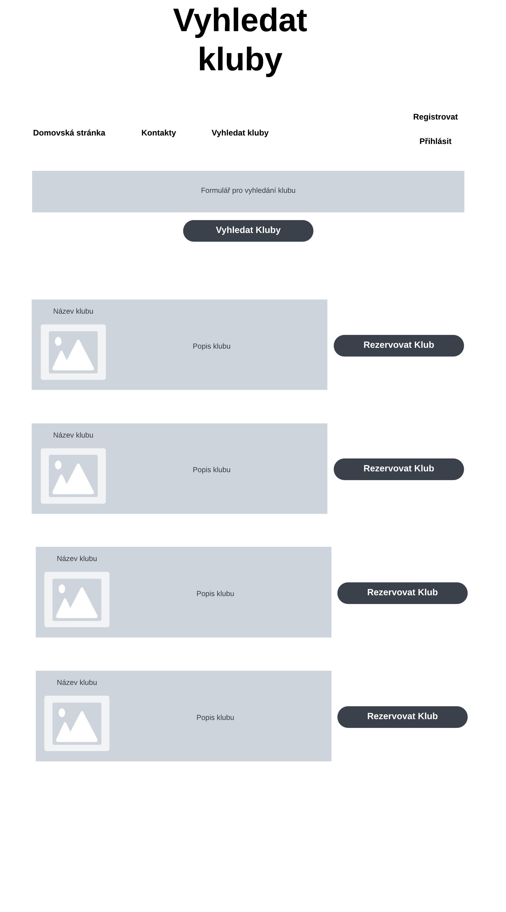

## Wireframe - Historie rezervací
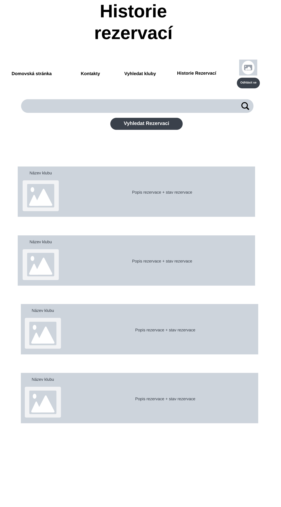

# Navigace

## Navigace pro nepřihlášeného uživatele
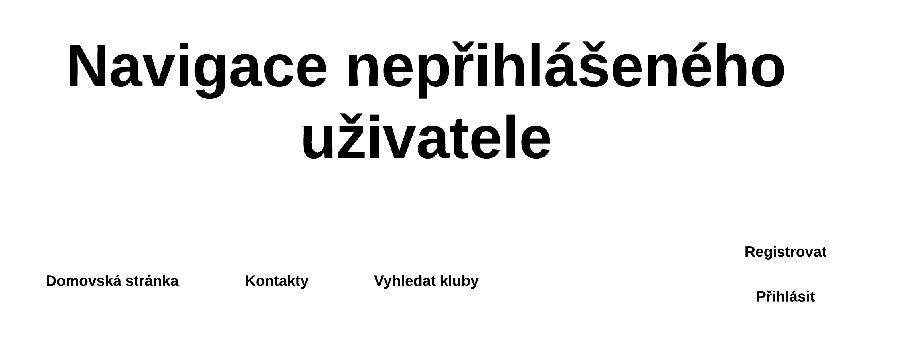

## Navigace pro přihlášeného uživatele
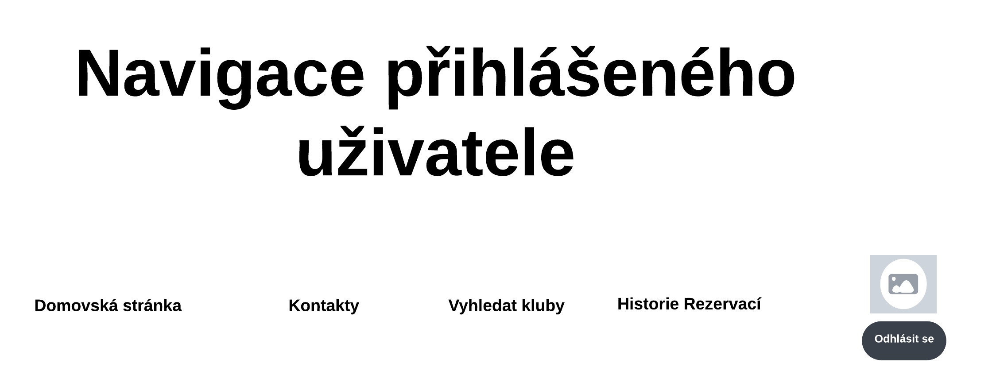

## Navigace pro správce
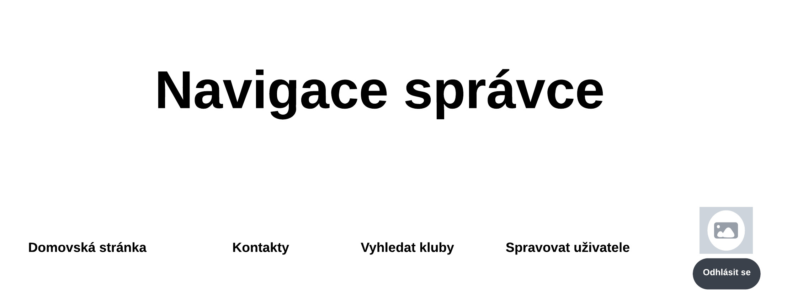

## Navigace pro majitele klubu
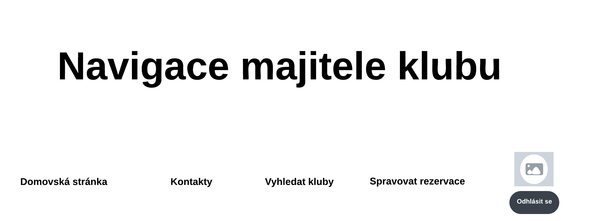

# Artefakt 5

# Třídní diagram
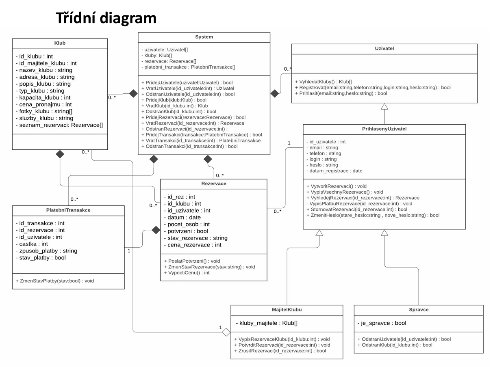

## Slovní popis jednotlivých vazeb
  1. Systému náleží 0..* klubů, uživatelů, rezervací a platebních transakcí.
     - Kluby, uživatelé, rezervace a platební transakce musí patřit do jednoho systému. 
  3. Přihlášenému uživateli může náležet 0..* rezervací.
     - Rezervace musí patřit právě jednomu přihlášenému uživateli. 
  5. Rezervaci musí náležet právě jedna platební transakce.
     - Platební transakce musí patřit právě jedné rezervaci. 
  7. Rezervace musí patřit právě jednomu klubu.
     - Klubu může náležet 0..* rezervací. 
  9. Majiteli klubu může náležet 0..* klubů.
     - Klub může patřit právě jednomu majiteli klubu.

# Sekvenční diagramy

## Sekvenční diagram - rezervace klubu
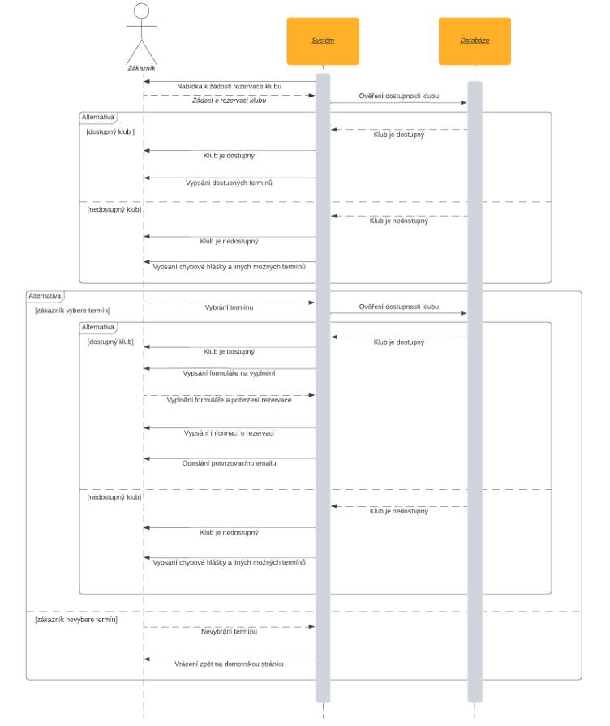

## Sekvenční diagram - platba rezervace
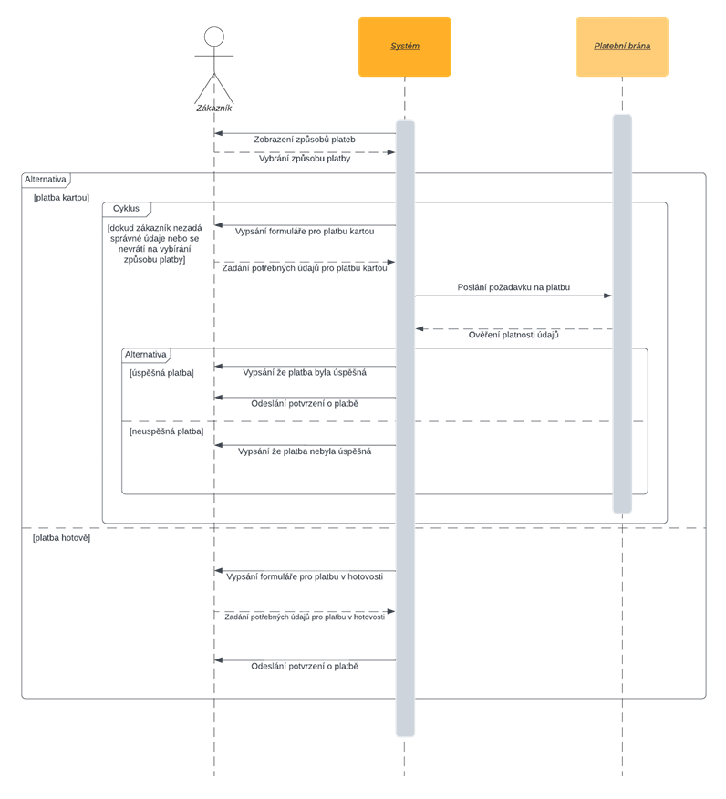

## Sekvenční diagram - vyhledat kluby
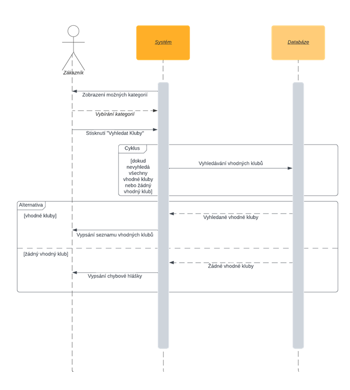
