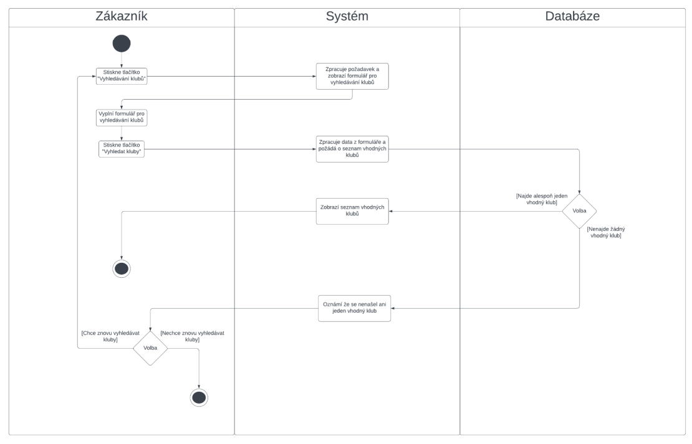

# VIS Projekt KAL0326 - Rezervace Klubů

## Proč
- Zákazník potřebuje nový informační systém, protože dosavadní rezervace klubů probíhaly komplikovaně a neefektivně.

## Co
- Systém bude obsahovat databázi klubů, které s námi budou ochotni spolupracovat. Databáze bude spojena s webovou stránkou, na které si registrovaný uživatel bude moct vyhledat a vybrat klub podle zadaných kategorií. 
- Systém umožní uživateli rezervaci klubu na zadané datum a čas. 
- Dále bude mít každý uživatel k dispozici jeho historii rezervací a plateb. 

## Kdo
### Registrovaný uživatel 
- Osoba, která chce pronajmout klub a používat služby systému pro rezervaci klubu na určité datum a čas. 
### Neregistrovaný uživatel 
- Osoba, která si nebude moct pronajmout klub, ale bude se moct podívat na nabídku klubů. 
### Majitel klubu
- Bude spolupracovat s tímto systémem a bude zveřejňovat informace o klubu v databázi.  
- Bude také přijímat rezervace a platby od zákazníků. 
### Správce systému 
- Osoba nebo tým, který bude spravovat systém a databázi klubů. 
- Bude také řešit technické a provozní záležitosti, jako je zabezpečení systému a udržování dostupnosti pro uživatele.

## Kde
- Celý systém bude běžet na nově vytvořené webové stránce. 
- Webová stránka bude komunikovat s databází, která slouží jako centrální uložiště všech klubů a všech podrobností o nich.
- Dále bude webová stránka komunikovat s platební bránou, která bude umožňovat rychlou a bezpečnou online platbu rezervací. 

## Kdy
- Systém bude využíván při rezervaci klubů a správě uživatelských účtů.

## Jak
- Systém bude vyvíjen agilním způsobem (viz. obrázek níže).

# Usecases
## Obrázek

## Use Case 3
### Název: Vytvořit rezervaci
- Aktéři: Uživatel, Systém
- Vstupní podmínky: Uživatel musí být registrovaný a přihlášený v systému a klub, který si vybral, musí existovat v databázi
- Spouštěč: Uživatel si chce rezervovat klub na dané datum a čas
- Úspěšný scénář:
  1. Uživatel se přihlásí do systému a chce podle zadaných podmínek vyhledat vhodný klub.
  2. Systém zpracuje požadavky uživatele a vrátí podle nich vyhovující kluby.
  3. Uživatel vybere ze seznamu klub
  4. Systém ověří dostupnost klubu na zvolené datum a čas a zobrazí uživateli rezervační formulář
  5. Uživatel vyplní rezervační formulář a bude chtít vytvořit rezervaci
  6. Systém zobrazí potvrzení rezervace a požádá uživatele o potvrzení.
  7. Uživatel potvrdí rezervaci.
  8. Systém odešle potvrzení rezervace uživateli a klubu.
  9. Systém vytvoří záznam o rezervaci v databázi a převede uživatele na platební bránu.
  10. Uživatel provede platbu.

### Aktivitní diagram pro Use Case 3

## Use Case 5 
### Název: Platba rezervace
- Aktéři: Uživatel, Systém, Platební brána
- Vstupní podmínky:
  1. Uživatel musí mít v systému vytvořenou rezervaci.
  2. Uživatel musí být přihlášený v systému.
  3. Platební brána musí být funkční a dostupná.
- Spouštěč: Uživatel si již vytvořil rezervaci klubu a chce provést platbu za tuto rezervaci
- Úspěšný scénář:
  1. Uživatel vybere rezervaci, kterou chce zaplatit.
  2. Systém uživateli zobrazí možnost pokračovat k platbě.
  3. Uživatel vybere preferovaný způsob platby.
  4. Systém přesměruje uživatele na platební bránu.
  5. Uživatel zadá potřebné platební údaje a potvrdí platbu.
  6. Platební brána ověří platbu.
  7. Systém obdrží informaci o úspěšné platbě.
  8. Systém vytvoří záznam o platbě v databázi.
  9. Systém pošle potvrzení o platbě uživateli a klubu.
  10. Rezervace je označena jako zaplacená a uživatel vidí stav v historii rezervací.

### Aktivitní diagram pro Use Case 5

## Use Case 1
### Název: Vyhledat kluby
- Aktéři: Uživatel, Systém
- Vstupní podmínky: : Uživatel zadá všechny potřebné požadavky pro vyhledávání
- Spouštěč: Uživatel chce vyhledat vhodný klub
- Úspěšný scénář:
  1. Uživatel chce vyhledat vhodné kluby podle jeho požadavků.
  2. Uživatel zadá všechny požadavky a klikne na tlačítko „Vyhledat Kluby“.
  3. Systém požadavky zpracuje a podle nich zobrazí uživateli vyhovující kluby.
  4. Uživateli se zobrazí kluby, které vyhovují jeho požadavkům.

### Aktivitní diagram pro Use Case 1

